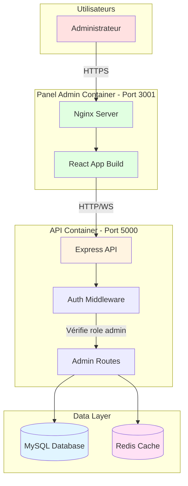

# Panel d'Administration - Application de Clavardage

## 📋 Table des matières
- [Description](#description)
- [Choix Techniques](#choix-techniques)
- [Architecture](#architecture)
- [Prérequis](#prérequis)
- [Installation](#installation)
- [Configuration](#configuration)
- [Lancement](#lancement)
- [Fonctionnalités](#fonctionnalités)
- [Utilisation](#utilisation)
- [Déploiement Docker](#déploiement-docker)
- [Sécurité](#sécurité)

## 📖 Description

Panel d'administration web pour la gestion de l'application de clavardage. Interface réservée aux administrateurs permettant de gérer les utilisateurs, les salons et les messages. Développé en React et déployable via Docker.

## 🔧 Choix Techniques

### Framework Frontend: React
**Justification:**
- **Réutilisation**: Même stack que le client desktop (cohérence du code)
- **Composants**: Interface modulaire et facilement maintenable
- **Performance**: Virtual DOM pour des mises à jour efficaces
- **Écosystème**: Bibliothèques riches pour les tableaux, graphiques, formulaires

### UI Library: Material-UI (MUI) ou Tailwind CSS
**Justification:**
- **Design professionnel**: Composants pré-stylisés et accessibles
- **Responsive**: Interface adaptative desktop/tablet
- **Productivité**: Développement rapide avec composants ready-to-use
- **Thème**: Cohérence visuelle avec le client desktop

### État: React Context API / Redux
**Justification:**
- **Gestion centralisée**: État admin, utilisateurs, permissions
- **Performance**: Évite les prop drilling excessifs
- **Dev tools**: Debugging facilité avec Redux DevTools

### Conteneurisation: Docker
**Justification:**
- **Isolation**: Séparation complète de l'API et du client
- **Déploiement**: Image unique, facilement déployable
- **Scalabilité**: Peut être dupliqué pour load balancing
- **Sécurité**: Container isolé avec permissions limitées

### Serveur Static: Nginx
**Justification:**
- **Performance**: Serveur web ultra-rapide pour fichiers statiques
- **Sécurité**: Configuration robuste et éprouvée
- **Cache**: Gestion optimale du cache navigateur
- **Léger**: Footprint minimal en production

## 🏗️ Architecture

### Schéma d'Architecture Globale



### Architecture des Composants React

```
Panel Admin App
│
├── Layout
│   ├── Navbar (logout, user info)
│   ├── Sidebar (navigation)
│   └── Main Content Area
│
├── Dashboard View
│   ├── Stats Cards (total users, channels, messages)
│   ├── Activity Graph
│   └── Recent Actions
│
├── Users Management View
│   ├── Users Table
│   │   ├── Search & Filters
│   │   ├── Pagination
│   │   └── Action Buttons (delete, edit role)
│   └── User Detail Modal
│
├── Channels Management View
│   ├── Channels Table
│   │   ├── Public/Private filter
│   │   ├── Search
│   │   └── Actions (delete, edit)
│   └── Channel Detail Modal
│
└── Messages Management View
    ├── Messages Table
    │   ├── Filter by channel/user
    │   ├── Search content
    │   └── Actions (delete)
    └── Message Detail Modal
```

### Structure des Dossiers

```
admin-panel/
├── public/
│   ├── index.html
│   └── favicon.ico
│
├── src/
│   ├── components/
│   │   ├── Layout/
│   │   │   ├── Navbar.jsx
│   │   │   ├── Sidebar.jsx
│   │   │   └── Footer.jsx
│   │   │
│   │   ├── Dashboard/
│   │   │   ├── StatsCard.jsx
│   │   │   ├── ActivityChart.jsx
│   │   │   └── RecentActions.jsx
│   │   │
│   │   ├── Users/
│   │   │   ├── UsersTable.jsx
│   │   │   ├── UserRow.jsx
│   │   │   ├── UserModal.jsx
│   │   │   └── UserFilters.jsx
│   │   │
│   │   ├── Channels/
│   │   │   ├── ChannelsTable.jsx
│   │   │   ├── ChannelRow.jsx
│   │   │   └── ChannelModal.jsx
│   │   │
│   │   ├── Messages/
│   │   │   ├── MessagesTable.jsx
│   │   │   ├── MessageRow.jsx
│   │   │   └── MessageModal.jsx
│   │   │
│   │   └── Common/
│   │       ├── ConfirmDialog.jsx
│   │       ├── LoadingSpinner.jsx
│   │       └── ErrorBoundary.jsx
│   │
│   ├── pages/
│   │   ├── Login.jsx
│   │   ├── Dashboard.jsx
│   │   ├── Users.jsx
│   │   ├── Channels.jsx
│   │   └── Messages.jsx
│   │
│   ├── services/
│   │   ├── api.js              # Client HTTP
│   │   ├── auth.js             # Gestion auth admin
│   │   └── websocket.js        # Connexion temps réel
│   │
│   ├── context/
│   │   ├── AuthContext.jsx     # État authentification
│   │   └── AdminContext.jsx    # État global admin
│   │
│   ├── hooks/
│   │   ├── useAdmin.js
│   │   ├── useUsers.js
│   │   └── useConfirm.js
│   │
│   ├── utils/
│   │   ├── validators.js
│   │   ├── formatters.js
│   │   └── constants.js
│   │
│   ├── styles/
│   │   └── index.css
│   │
│   ├── App.jsx
│   └── index.jsx
│
├── Dockerfile
├── nginx.conf
├── docker-compose.yml
├── package.json
└── README.md
```

## 📋 Prérequis

### Pour le développement
- **Node.js**: Version 18.x ou supérieure
- **npm**: Version 9.x ou supérieure
- **API Backend**: Doit être en cours d'exécution

### Pour le déploiement
- **Docker**: Version 20.10+
- **Docker Compose**: Version 2.0+

## 🚀 Installation

1. **Cloner le repository**
```bash
git clone https://github.com/FrankSanterre/PROJETMULTI_PANEL_ADMIN.git
cd PROJETMULTI_PANEL_ADMIN
git checkout develop
```

2. **Installer les dépendances**
```bash
npm install
```

## 🎯 Lancement

### Mode Développement (sans Docker)

```bash
# Démarrer le serveur de développement
npm start
```

L'application sera accessible à: `http://localhost:3001`

### Mode Production avec Docker

```bash
# Build de l'image Docker
docker build -t admin-panel:latest .

# Lancer le conteneur
docker run -d \
  -p 3001:80 \
  -e REACT_APP_API_URL=http://localhost:5000/api \
  --name admin-panel \
  admin-panel:latest
```

### Avec Docker Compose (recommandé)

```bash
# Démarrer le panel admin
docker-compose up -d

# Voir les logs
docker-compose logs -f

# Arrêter
docker-compose down
```

## ✨ Fonctionnalités

### 🔐 Authentification Admin

- **Login sécurisé**: Connexion réservée aux comptes admin
- **Validation du rôle**: Vérification côté API que l'utilisateur est admin
- **Session persistante**: Token JWT stocké localement
- **Auto-logout**: Déconnexion automatique après expiration du token

### 📊 Dashboard

- **Statistiques globales**:
  - Nombre total d'utilisateurs
  - Nombre de salons actifs
  - Messages envoyés (total et aujourd'hui)
  - Utilisateurs en ligne actuellement

- **Graphiques d'activité**:
  - Messages par jour (7 derniers jours)
  - Nouveaux utilisateurs par semaine
  - Salons les plus actifs

- **Actions récentes**:
  - Derniers utilisateurs inscrits
  - Derniers salons créés
  - Activité administrative récente

### 👥 Gestion des Utilisateurs

**Fonctionnalités:**
- ✅ Liste complète des utilisateurs avec pagination
- ✅ Recherche par nom d'utilisateur ou email
- ✅ Filtres: rôle (user/moderator/admin), statut (online/offline)
- ✅ Tri: par date d'inscription, dernière connexion, nom
- ✅ Actions:
  - 🔍 Voir les détails complets
  - ✏️ Modifier le rôle (user ↔ moderator ↔ admin)
  - 🚫 Bannir temporairement
  - 🗑️ Supprimer définitivement (avec confirmation)

**Informations affichées:**
- ID, Username, Email
- Rôle actuel
- Statut (en ligne/hors ligne)
- Date d'inscription
- Dernière connexion
- Nombre de messages envoyés
- Salons rejoints

### 💬 Gestion des Salons

**Fonctionnalités:**
- ✅ Liste de tous les salons (publics et privés)
- ✅ Filtres: type (public/private), activité
- ✅ Recherche par nom
- ✅ Actions:
  - 🔍 Voir les membres
  - 📊 Statistiques du salon
  - ✏️ Modifier (nom, description, type)
  - 🗑️ Supprimer (avec confirmation)

**Informations affichées:**
- Nom et description
- Type (public/privé)
- Créateur
- Nombre de membres
- Nombre de messages
- Date de création
- Dernier message

### 📨 Gestion des Messages

**Fonctionnalités:**
- ✅ Liste des messages avec pagination
- ✅ Filtres: par salon, par utilisateur, par date
- ✅ Recherche dans le contenu
- ✅ Actions:
  - 🔍 Voir le contexte complet
  - 🗑️ Supprimer (modération)
  - ⚠️ Signaler comme inapproprié

**Informations affichées:**
- Contenu du message
- Auteur
- Salon
- Date d'envoi
- Édité (oui/non)
- Statut (normal/signalé/supprimé)

### 🔔 Notifications en Temps Réel

- **WebSocket**: Connexion au serveur pour les mises à jour live
- **Événements surveillés**:
  - Nouvel utilisateur inscrit
  - Nouveau salon créé
  - Message signalé
  - Activité suspecte détectée

### 📈 Logs et Audit

- **Journal d'activité**: Toutes les actions administratives enregistrées
- **Traçabilité**: Qui a fait quoi et quand
- **Export**: Possibilité d'exporter les logs (CSV)

## 🖥️ Utilisation

### 1. Première Connexion

1. Accéder à `http://localhost:3001`
2. Entrer vos identifiants admin:
   - Email: `admin@example.com`
   - Password: `admin123` (à changer immédiatement!)
3. Vous serez redirigé vers le dashboard

### 2. Navigation

**Menu principal:**
- 📊 **Dashboard**: Vue d'ensemble et statistiques
- 👥 **Utilisateurs**: Gestion des comptes
- 💬 **Salons**: Gestion des channels
- 📨 **Messages**: Modération des messages
- 📜 **Logs**: Historique des actions admin

### 3. Gestion Utilisateur - Cas d'usage

**Promouvoir un utilisateur en modérateur:**
1. Aller dans "Utilisateurs"
2. Rechercher l'utilisateur
3. Cliquer sur l'icône d'édition (✏️)
4. Sélectionner rôle "Moderator"
5. Confirmer

**Supprimer un utilisateur:**
1. Trouver l'utilisateur dans la liste
2. Cliquer sur l'icône de suppression (🗑️)
3. **Popup de confirmation** apparaît avec avertissement
4. Taper "DELETE" pour confirmer
5. Utilisateur supprimé + logs enregistrés

### 4. Modération de Messages

**Supprimer un message inapproprié:**
1. Aller dans "Messages"
2. Filtrer par salon ou rechercher par contenu
3. Trouver le message problématique
4. Cliquer sur "Supprimer"
5. Confirmer avec raison (optionnel)

**Voir le contexte d'un message:**
1. Cliquer sur le message
2. Modal affiche:
   - 5 messages avant
   - Message actuel (surligné)
   - 5 messages après
   - Informations complètes sur l'auteur

### 5. Gestion des Salons

**Supprimer un salon inactif:**
1. Aller dans "Salons"
2. Trier par "Dernier message" (ascendant)
3. Identifier les salons abandonnés
4. Supprimer avec confirmation
5. ⚠️ **Attention**: Supprime aussi tous les messages!

## 🐳 Déploiement Docker

### Dockerfile

Le `Dockerfile` utilise un build multi-stage pour optimiser la taille:

```dockerfile
# Stage 1: Build
FROM node:18-alpine AS build
WORKDIR /app
COPY package*.json ./
RUN npm ci --only=production
COPY . .
RUN npm run build

# Stage 2: Production
FROM nginx:alpine
COPY --from=build /app/build /usr/share/nginx/html
COPY nginx.conf /etc/nginx/conf.d/default.conf
EXPOSE 80
CMD ["nginx", "-g", "daemon off;"]
```

### Configuration Nginx

Le fichier `nginx.conf` optimisé:

```nginx
server {
    listen 80;
    server_name localhost;
    root /usr/share/nginx/html;
    index index.html;

    # Compression gzip
    gzip on;
    gzip_types text/css application/javascript application/json;
    gzip_min_length 1000;

    # Cache pour les assets statiques
    location ~* \.(js|css|png|jpg|jpeg|gif|ico|svg|woff|woff2|ttf|eot)$ {
        expires 1y;
        add_header Cache-Control "public, immutable";
    }

    # SPA routing - tout redirige vers index.html
    location / {
        try_files $uri $uri/ /index.html;
    }

    # Security headers
    add_header X-Frame-Options "SAMEORIGIN" always;
    add_header X-Content-Type-Options "nosniff" always;
    add_header X-XSS-Protection "1; mode=block" always;
    add_header Referrer-Policy "no-referrer-when-downgrade" always;

    # API proxy (optionnel, si même domaine)
    location /api/ {
        proxy_pass http://api:5000/api/;
        proxy_http_version 1.1;
        proxy_set_header Upgrade $http_upgrade;
        proxy_set_header Connection 'upgrade';
        proxy_set_header Host $host;
        proxy_cache_bypass $http_upgrade;
    }
}
```

### Docker Compose

Fichier `docker-compose.yml` pour orchestrer tous les services:

```yaml
version: '3.8'

services:
  # API Backend
  api:
    image: chat-api:latest
    container_name: chat-api
    ports:
      - "5000:5000"
    environment:
      - NODE_ENV=production
      - DB_HOST=mysql
      - REDIS_HOST=redis
    depends_on:
      - mysql
      - redis
    networks:
      - chat-network

  # Base de données MySQL
  mysql:
    image: mysql:8.0
    container_name: chat-mysql
    environment:
      - MYSQL_ROOT_PASSWORD=rootpassword
      - MYSQL_DATABASE=chat_app
      - MYSQL_USER=chatuser
      - MYSQL_PASSWORD=chatpassword
    volumes:
      - mysql-data:/var/lib/mysql
    networks:
      - chat-network

  # Redis pour pub/sub
  redis:
    image: redis:7-alpine
    container_name: chat-redis
    networks:
      - chat-network

  # Panel Admin
  admin-panel:
    build: .
    container_name: chat-admin-panel
    ports:
      - "3001:80"
    environment:
      - REACT_APP_API_URL=http://localhost:5000/api
    depends_on:
      - api
    networks:
      - chat-network

networks:
  chat-network:
    driver: bridge

volumes:
  mysql-data:
```

### Commandes Docker

```bash
# Build toutes les images
docker-compose build

# Démarrer tous les services
docker-compose up -d

# Vérifier l'état des conteneurs
docker-compose ps

# Voir les logs
docker-compose logs -f admin-panel

# Redémarrer uniquement le panel admin
docker-compose restart admin-panel

# Arrêter tous les services
docker-compose down

# Supprimer tout (y compris volumes)
docker-compose down -v
```

## ⚠️ Limitations et Contraintes

### Fonctionnelles
- **Export de données**: Format CSV uniquement, pas d'Excel
- **Recherche**: Pas de recherche full-text avancée
- **Bulk actions**: Pas d'actions en masse (sélection multiple)
- **Permissions granulaires**: Seulement 3 rôles (user/moderator/admin)
- **Rapports**: Statistiques basiques uniquement

### Techniques
- **Real-time**: WebSocket peut avoir un délai de 1-2 secondes
- **Pagination**: Max 100 éléments par page
- **Upload**: Pas de modification d'avatar depuis le panel
- **API calls**: Pas de retry automatique en cas d'échec

### Sécurité
- **2FA**: Non implémenté pour les admins
- **IP Whitelisting**: À configurer manuellement
- **Audit avancé**: Pas de détection d'anomalies automatique

## 🐛 Problèmes Connus

| Problème | Impact | Solution temporaire |
|----------|--------|---------------------|
| Timeout sur grandes listes | Performance | Réduire limit de pagination |
| WebSocket disconnect | Perte updates live | Rafraîchir la page |
| Modal ne se ferme pas | UI bloquée | Recharger la page |
| Export CSV avec accents | Caractères mal encodés | Ouvrir avec UTF-8 |

## 🚀 Roadmap

### Version 1.1 (Court terme)
- [ ] Actions en masse (bulk delete, bulk role change)
- [ ] Export Excel (XLSX)
- [ ] Filtres avancés avec sauvegarde
- [ ] Dark mode
- [ ] Notifications push pour admins

### Version 1.2 (Moyen terme)
- [ ] Dashboard personnalisable (widgets)
- [ ] Rapports automatiques hebdomadaires
- [ ] Détection d'anomalies (spam, bots)
- [ ] Backup/restore de la base de données
- [ ] Gestion des permissions granulaires

### Version 2.0 (Long terme)
- [ ] Multi-tenancy (plusieurs organisations)
- [ ] API GraphQL pour le panel
- [ ] Application mobile admin (React Native)
- [ ] Intégration avec outils externes (Slack, Discord)
- [ ] Machine learning pour modération automatique

## 🔧 Dépannage

### Problème: Panel ne se connecte pas à l'API

**Symptômes:** Erreur "Network Error" ou "Failed to fetch"

**Solutions:**
1. Vérifier que l'API est bien démarrée:
```bash
curl http://localhost:5000/health
```

2. Vérifier la configuration CORS dans l'API

3. Vérifier l'URL dans `.env`:
```env
REACT_APP_API_URL=http://localhost:5000/api
```

4. Vérifier le réseau Docker:
```bash
docker network inspect chat-network
```

### Problème: "Forbidden: Admin access only"

**Cause:** L'utilisateur connecté n'a pas le rôle admin

**Solution:**
1. Promouvoir l'utilisateur en admin via MySQL:
```sql
UPDATE users SET role = 'admin' WHERE email = 'votre@email.com';
```

2. Se déconnecter et reconnecter

### Problème: Container crash au démarrage

**Logs à vérifier:**
```bash
docker logs chat-admin-panel
```

**Solutions courantes:**
- Port 3001 déjà utilisé → Changer le port dans docker-compose.yml
- Problème de build → Rebuild l'image: `docker-compose build --no-cache admin-panel`
- Variable d'environnement manquante → Vérifier le fichier `.env`

### Problème: Page blanche après build

**Cause:** Problème de routing avec Nginx

**Solution:**
Vérifier que `nginx.conf` contient:
```nginx
location / {
    try_files $uri $uri/ /index.html;
}
```

## 📚 Ressources et Documentation

### Documentation Officielle
- [React Documentation](https://react.dev/)
- [Material-UI](https://mui.com/)
- [Nginx Documentation](https://nginx.org/en/docs/)
- [Docker Documentation](https://docs.docker.com/)

### Tutoriels et Guides
- [React Admin Panel Best Practices](https://example.com)
- [Securing Admin Panels](https://example.com)
- [Docker Multi-Stage Builds](https://example.com)

## 📄 Licence

Ce projet est développé dans le cadre du cours **420-5A6-ST – A25** au Cégep de Saint-Hyacinthe.

## 👥 Équipe de Développement

### Contributeurs
- **Frank Santerre** - Lead Developer
- **[Membre 2]** - Backend Integration
- **[Membre 3]** - UI/UX Design

### Rôles
- **Product Owner**: Olivier Fortin (Professeur)
- **Scrum Master**: [Nom du membre]
- **Développeurs**: Toute l'équipe

## 🙏 Remerciements

Un grand merci à:
- **Olivier Fortin** - Professeur du cours 420-5A6-ST
- **Cégep de Saint-Hyacinthe** - Pour les ressources et l'infrastructure
- **La communauté React** - Pour les excellents outils et bibliothèques

## 📞 Support et Contact

### Pour les questions techniques
- **GitHub Issues**: [Créer une issue](https://github.com/FrankSanterre/PROJETMULTI_PANEL_ADMIN/issues)
- **Teams**: Canal de projet dédié
- **Email équipe**: [votre-email@example.com]

### Pour signaler des bugs
1. Créer une issue sur GitHub avec:
   - Description du problème
   - Steps to reproduce
   - Logs d'erreur (si disponibles)
   - Captures d'écran

### Pour proposer des améliorations
1. Ouvrir une discussion sur GitHub
2. Créer une pull request avec votre proposition

---

## 📋 Checklist de Déploiement

Avant de déployer en production, vérifier:

- [ ] Toutes les variables d'environnement sont configurées
- [ ] Les secrets ne sont PAS dans le code
- [ ] HTTPS est activé (certificat SSL)
- [ ] CORS est configuré avec les bons domaines
- [ ] Rate limiting est activé
- [ ] Logs sont configurés et centralisés
- [ ] Backup de la base de données est planifié
- [ ] Monitoring est en place (uptime, erreurs)
- [ ] Tests E2E passent tous
- [ ] Documentation est à jour
- [ ] L'équipe sait comment rollback en cas de problème

---

**Version**: 1.0.0  
**Date de dernière mise à jour**: Octobre 2025  
**Statut**: ✅ Prêt pour la production

**Date de remise du projet**: 7 septembre 2025, 23h59
